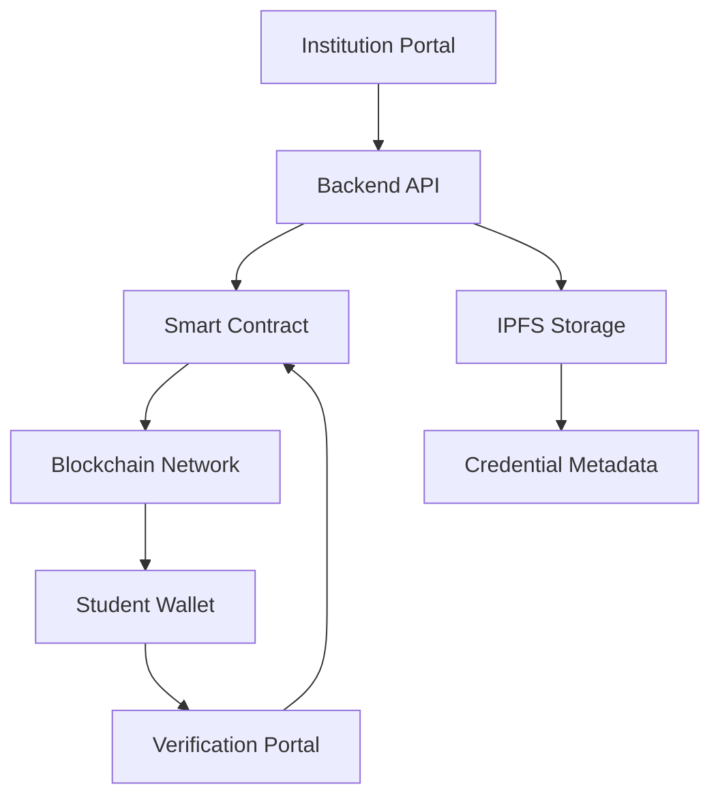

# 🛡️ EduChain — Verifiable Education Infrastructure on Blockchain (Plokadot Bootcamp Ideathon)

> **A decentralized system for issuing, managing, and verifying academic credentials — instantly, securely, and globally.**

---

## 🌍 Why EduChain Exists

Credential fraud, slow verification, and fragmented education systems continue to limit opportunities worldwide.

* Employers wait **days to weeks** to verify records
* Institutions rely on **manual, outdated systems**
* Students don’t truly **own their credentials**

In a digital-first world, education remains **locked in centralized silos**.

---

## 💡 Our Vision

EduChain transforms education into a **trustless, borderless, and student-owned ecosystem**.

We believe:

> Credentials should be **immutable**
> Verification should be **instant**
> Education should be **globally interoperable**

---

## 🚀 What EduChain Does

EduChain uses blockchain to:

* Store **tamper-proof credential records**
* Enable **real-time verification**
* Give students **full ownership via digital wallets**
* Allow **cross-border recognition of credentials**

---

## 🖼️ Product Walkthrough

### 1. 🎓 Institution Issues Credential

* Upload student credential
* System generates secure hash

### 2. 👤 Student Receives Credential

* Stored in digital wallet
* Fully owned and shareable

### 3. 🔍 Employer Verifies Instantly

* Input credential ID
* Verified directly via blockchain

---

## 🧱 Core Features

### 📜 Blockchain Credential Issuance

* Certificates recorded on-chain
* Immutable and tamper-proof

### 🔍 Instant Verification System

* No intermediaries required
* Trustless validation

### 👤 Student Wallet

* Own and manage credentials
* Secure sharing via links

### 📦 IPFS Storage Integration

* Efficient off-chain metadata storage
* Reduced blockchain costs

### 🪙 NFT-based Credentials *(Future Scope)*

* Portable, globally recognized certificates

---

## 🏗️ System Architecture

EduChain is designed as a **hybrid on-chain + off-chain system** to balance scalability, cost, and security.

---

### 🔐 Architecture Overview



---

### 🧩 Core Components

#### 🎓 Institution Portal

* Interface for schools / LGUs
* Issues and manages credentials

#### ⚙️ Backend API

* Handles validation and hashing
* Connects frontend to blockchain

#### 🔗 Smart Contracts

* Store credential hashes
* Enable secure verification

#### 🌐 Blockchain Layer

* Immutable record system (Ethereum / Polygon)

#### 📦 IPFS Storage

* Stores credential files & metadata
* Linked via on-chain hash

#### 👤 Student Wallet

* Holds credentials
* Enables secure sharing

#### 🔍 Verification Portal

* Allows instant authenticity checks

---

### 🔄 Data Flow

1. Institution uploads credential
2. Backend generates hash
3. Hash stored on blockchain
4. Metadata stored in IPFS
5. Student receives credential
6. Employer verifies instantly

---

### ⚡ Design Decisions

* ✅ Store **hashes on-chain** → lower cost, higher efficiency
* ✅ Use **IPFS off-chain storage** → scalable data handling
* ✅ Implement **wallet-based identity** → true ownership
* ✅ Modular backend → ready for LGU integration

---

## 🧪 Tech Stack

| Layer           | Technology             |
| --------------- | ---------------------- |
| Smart Contracts | Solidity               |
| Blockchain      | Ethereum / Polygon     |
| Backend         | Node.js / Express      |
| Frontend        | React                  |
| Storage         | IPFS                   |
| Authentication  | Web3 Wallet (MetaMask) |

---

## 🌍 Real-World Applications

* Universities issuing diplomas
* Local Government Units (LGUs)
* Employers verifying applicants
* Cross-border education systems

---

## 📊 Impact

* **Instant verification** (vs weeks)
* **Zero tampering risk**
* Reduced operational costs
* Global accessibility

---

## 🚀 Getting Started

```bash
git clone https://github.com/TiffnieXAI/EduChain.git
cd EduChain
npm install
npm start
```

---

## 🛣️ Roadmap

* [x] MVP: Credential Issuance & Verification
* [x] Smart Contract Deployment
* [ ] NFT Credentials
* [ ] AI Fraud Detection Layer
* [ ] LGU Integration
* [ ] Mobile Application

---

## 🧠 Innovation Edge

EduChain is not just a system, it’s an **infrastructure**.

* Combines **Blockchain + Education + AI potential**
* Designed for **real deployment (LGUs & institutions)**
* Built for **scalability and national-level adoption**


---

## 💬 Final Note

> “Education should not be questioned, it should be verified instantly.”

EduChain is building the foundation for a **trustless education future**.
